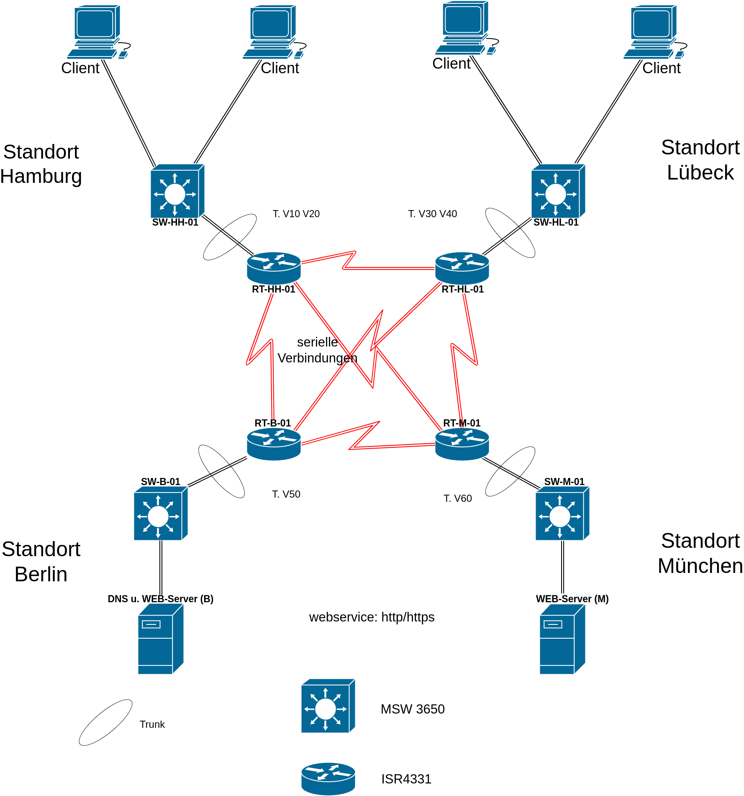

# Details zum Auftrag

### Anforderungen an das Netzwerk
[ ] Alle (Infrastruktur-) Geräte, Server und Clients sollen nativ mit IPv6 betrieben werden (kein "dual stack") (Hinweis zu den verwendeten Modellen: Layer3 Switch 3650 und Router 4331 )

[ ] Für die Transportnetze (Verbindungen der Router untereinander) sollen Unique Local Unicast Adressen verwendet werden (fd00..)

[ ]  Für die Standortnetze sollen Global Unicast Adressen verwendet werden

[ ] Für das gesamte Demonetz steht der Provider Independent Address Space (PI-Space) 2001:db8:: /32 zur Verfügung

[ ] Durch die Konfiguration statischer Routen soll die Erreichbarkeit der Netze untereinander gewährleistet werden

[ ] An den Standorten HH und HL soll es je zwei, durch VLANs getrennte Netzwerke, mit eigenem globalen Präfix geben

[ ] An den Standorten B und M soll es mindestens je ein VLAN für den jeweiligen Server mit eigenem globalen Präfix geben

[ ] Die Standortnetzwerke werden mittels eines Routers und L3 Switches eingerichtet

[ ] Clients und Server erhalten „globale Unicast Adressen“

[ ] Die Adressvergabe soll zunächst statisch er

